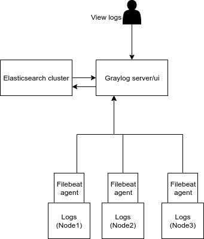

# Graylog Ansible with Filebeat

This ansible module automates the deployment of graylog server with elasticsearch and filebeats. Filebeats agents are installed to nodes which have logs to collect. After that logs can be analysed with graylog ui.

### Archtecture Overview



### Configure ansible inventory

`inventory` file is located in `dev/` directory. You need to insert correct hostnames,usernames.

```ini

# Filebeat agents are installed and run in these nodes. Logs are collected from these nodes and send 
# to graylog server. You can define any number of filebeat hosts. To configure log paths in each node 
# change the log_paths variable in host_vars
[beats]
#beats_1 ansible_host=[ip_address] ansible_user=[ssh_user]
#Example
beats_1 ansible_host=localhost ansible_user=ubuntu

# Where Graylog server is installed.
[graylog]
#graylog_1 ansible_host=[ip_address] ansible_user=[ssh_user]
#Example
graylog_1 ansible_host=10.130.0.84 ansible_user=ubuntu

# Where Elasticsearch is installed
[elastic]
#elastic_1 ansible_host=[ip_address] ansible_user=[ssh_user]
#Example
elastic_1 ansible_host=10.130.0.84 ansible_user=ubuntu
```
### Configure filebeats nodes
You can configure logpaths to be collected in each hosts by definig log_paths variable in `host_vars`

Ex: In `./host_vars/beats_1.yml`
```yaml
log_paths: [/logpath/1,/logpath/2]
```

Then configure `graylog_host` and `port` in each filebeat host_var file. If you use only one graylog host you can move those variable in to `group_vars/beats.yml`.

Ex: If graylog server is running on 10.130.0.84 and port 5044 (default filebeat log collector port in graylog)
In `host_vars/beats_1.yml`
```yml
graylog_host: 10.130.0.84
graylog_port: 5044
```
### Configure graylog server

In this I have used only single node graylog sever. So configurations are valid only for single gralog node. Variables are located in `group_vars/graylog.yml`

```yml
graylog_home: /mnt/graylog-3.1.2
# Graylog runs as this user
graylog_user: ubuntu

http_bind_address: "0.0.0.0:9000"
# Replace with public ip if you access from internet
http_publish_uri: "http://10.130.0.84:9000/"

api_url: "http://10.130.0.84:9000/api"

# You MUST specify a hash password for the root user (which you only need to initially set up the
# system and in case you lose connectivity to your authentication backend)
# This password cannot be changed using the API or via the web interface. If you need to change it,
# modify it in /etc/graylog/server/server.conf file.
# Create one by using for example: echo -n yourpassword | shasum -a 256
# and put the resulting hash value into the following line
# Replace new one
root_password_sha2: 8c6976e5b5410415bde908bd4dee15dfb167a9c873fc4bb8a81f6f2ab448a918
root_username: admin

# You MUST set a secret to secure/pepper the stored user passwords here. Use at least 64 characters.
# Generate one by using for example: pwgen -N 1 -s 96
# Replace new one
password_secret: ukwOCvEOq1Kk1txquFu5F39S8vDsKkK8u5JRkl2rYqVARB0QK8HkkZm9DcwrgsNknpvXtbdaY1MAH8NwIeLBtaokitx9AEb3
```

### Configure Elasticsearch

This module is written to single elastic node. So most of default configurations will work out of the box.
However to run elasticsearch as service you need to define a user in `group_vars/elastic.yml.
```yml
elastic_home: /mnt/elasticsearch-6.8.2
# Elastic search runs as this user
elastic_user: ubuntu
```
### Running ansible

Next step is to runing the ansible. Before that make sure ssh keys are configured to log in each host. ( better to define in .ssh/config)

Then run the ansible playbook in root folder by following (`site.yml`).

`ansible-playbook site.yml -i dev -v`

`-i` defines the inventory folder. You can add another invetory folder and run as above.

